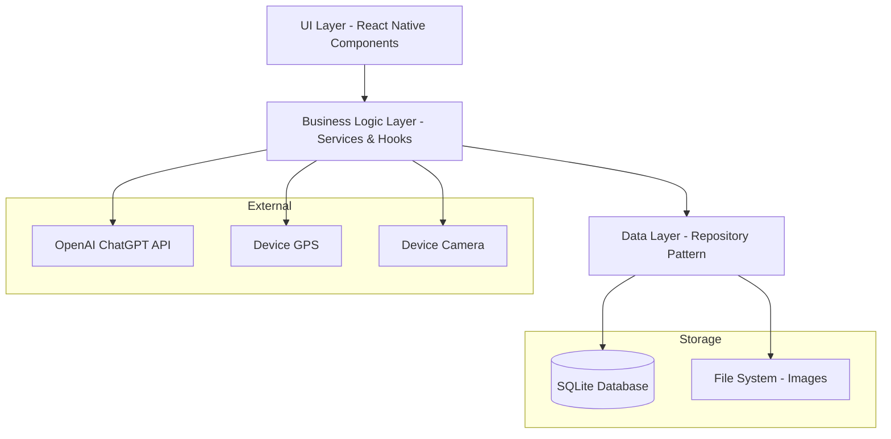

# Design Document

## Overview

The Natural Wine Detector is an Android application built using React Native for cross-platform compatibility and future iOS support. The app follows a clean architecture pattern with clear separation between UI, business logic, and data layers. The application integrates with OpenAI's ChatGPT API for image analysis and uses SQLite for local data persistence.

## Architecture

### High-Level Architecture



### Technology Stack

- **Framework**: React Native 0.72+
- **Language**: TypeScript for type safety
- **Database**: SQLite with react-native-sqlite-storage
- **API Client**: Axios for HTTP requests
- **Image Handling**: react-native-image-picker and react-native-image-resizer
- **Location Services**: @react-native-community/geolocation
- **Navigation**: React Navigation 6
- **State Management**: React Context + useReducer for global state
- **Permissions**: react-native-permissions

## Components and Interfaces

### Core Components

#### 1. Camera Component
```typescript
interface CameraComponentProps {
  onImageCaptured: (imageUri: string, location?: LocationData) => void;
  onError: (error: string) => void;
}
```

#### 2. Wine Analysis Component
```typescript
interface WineAnalysisProps {
  imageUri: string;
  onAnalysisComplete: (result: WineAnalysisResult) => void;
}

interface WineAnalysisResult {
  isNaturalWine: boolean;
  confidenceScore: number;
  explanation: string;
  timestamp: Date;
}
```

#### 3. Wine Logging Component
```typescript
interface WineLoggingProps {
  analysisResult: WineAnalysisResult;
  imageUri: string;
  capturedLocation?: LocationData;
  onSave: (wineRecord: WineRecord) => void;
}

interface WineRecord {
  id: string;
  imageUri: string;
  analysisResult: WineAnalysisResult;
  consumed: boolean;
  location?: LocationData; // Location where photo was taken
  notes?: string;
  createdAt: Date;
}
```

#### 4. Wine History Component
```typescript
interface WineHistoryProps {
  wines: WineRecord[];
  onWineSelect: (wine: WineRecord) => void;
}
```

### Service Interfaces

#### ChatGPT Service
```typescript
interface ChatGPTService {
  analyzeWineImage(imageBase64: string): Promise<WineAnalysisResult>;
}
```

#### Location Service
```typescript
interface LocationService {
  getCurrentLocation(): Promise<LocationData>;
  requestLocationPermission(): Promise<boolean>;
}

interface LocationData {
  latitude: number;
  longitude: number;
  accuracy: number;
}
```

#### Wine Repository
```typescript
interface WineRepository {
  saveWine(wine: WineRecord): Promise<void>;
  getAllWines(): Promise<WineRecord[]>;
  getWineById(id: string): Promise<WineRecord | null>;
  deleteWine(id: string): Promise<void>;
}
```

## Data Models

### Database Schema

```sql
CREATE TABLE wines (
  id TEXT PRIMARY KEY,
  image_uri TEXT NOT NULL,
  is_natural_wine BOOLEAN NOT NULL,
  confidence_score INTEGER NOT NULL,
  explanation TEXT,
  consumed BOOLEAN NOT NULL DEFAULT 0,
  latitude REAL,
  longitude REAL,
  location_accuracy REAL,
  notes TEXT,
  created_at DATETIME NOT NULL,
  analysis_timestamp DATETIME NOT NULL
);

CREATE INDEX idx_wines_created_at ON wines(created_at DESC);
CREATE INDEX idx_wines_consumed ON wines(consumed);
```

### TypeScript Models

```typescript
interface WineRecord {
  id: string;
  imageUri: string;
  isNaturalWine: boolean;
  confidenceScore: number; // 0-100
  explanation: string;
  consumed: boolean;
  location?: {
    latitude: number;
    longitude: number;
    accuracy: number;
  };
  notes?: string;
  createdAt: Date;
  analysisTimestamp: Date;
}

interface AppState {
  wines: WineRecord[];
  currentAnalysis?: WineAnalysisResult;
  loading: boolean;
  error?: string;
}
```

## Error Handling

### Error Categories

1. **Network Errors**: API connectivity issues, timeout, rate limiting
2. **Permission Errors**: Camera or location access denied
3. **Storage Errors**: Database write failures, insufficient storage
4. **Image Processing Errors**: Invalid image format, processing failures
5. **API Errors**: ChatGPT API errors, invalid responses

### Error Handling Strategy

```typescript
interface AppError {
  type: 'network' | 'permission' | 'storage' | 'image' | 'api';
  message: string;
  recoverable: boolean;
  retryAction?: () => void;
}

class ErrorHandler {
  static handle(error: AppError): void {
    // Log error for debugging
    // Show user-friendly message
    // Provide recovery options if available
  }
}
```

### Retry Logic

- **API Calls**: Exponential backoff with max 3 attempts
- **Database Operations**: Immediate retry once, then fail gracefully
- **Image Processing**: Allow user to retake photo
- **Location Services**: Retry with timeout, fallback to manual entry

## Testing Strategy

### Unit Testing
- Service layer functions (ChatGPT API, Location, Database)
- Utility functions (image processing, data validation)
- Business logic hooks and state management

### Integration Testing
- Database operations with SQLite
- API integration with mock ChatGPT responses
- Camera and location permission flows

### Component Testing
- React Native component rendering
- User interaction flows
- Navigation between screens

### End-to-End Testing
- Complete wine analysis workflow
- Data persistence across app restarts
- Offline functionality validation

### Performance Testing
- Image processing and compression
- Database query performance
- Memory usage during image operations
- API response time handling

## Security Considerations

### API Key Management
- Store OpenAI API key securely using react-native-keychain
- Implement API key rotation capability
- Monitor API usage to prevent abuse

### Data Privacy
- All data stored locally on device
- No personal data transmitted to external services except images to ChatGPT
- Clear data deletion on app uninstall
- Location data encrypted in local storage

### Image Handling
- Compress images before API transmission
- Clean up temporary image files
- Validate image format and size before processing

## Performance Optimizations

### Image Processing
- Compress images to max 1MB before API calls
- Use WebP format for local storage when supported
- Implement image caching for history view

### Database Performance
- Index frequently queried columns
- Implement pagination for wine history
- Use prepared statements for queries

### Memory Management
- Dispose of large image objects after processing
- Implement proper cleanup in useEffect hooks
- Monitor memory usage during image operations

### API Efficiency
- Implement request deduplication
- Cache API responses for identical images
- Batch multiple operations when possible